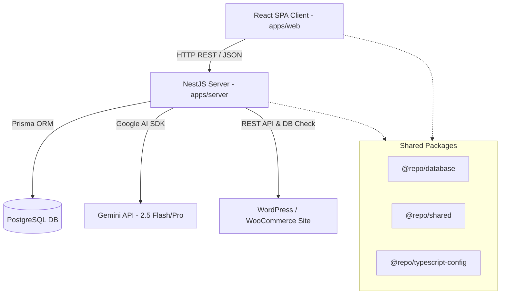
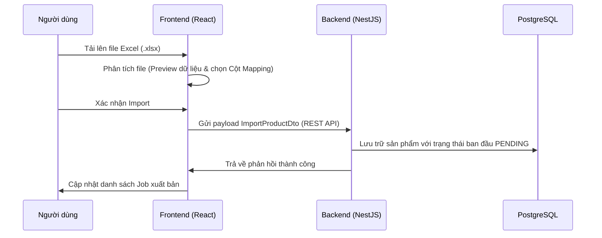
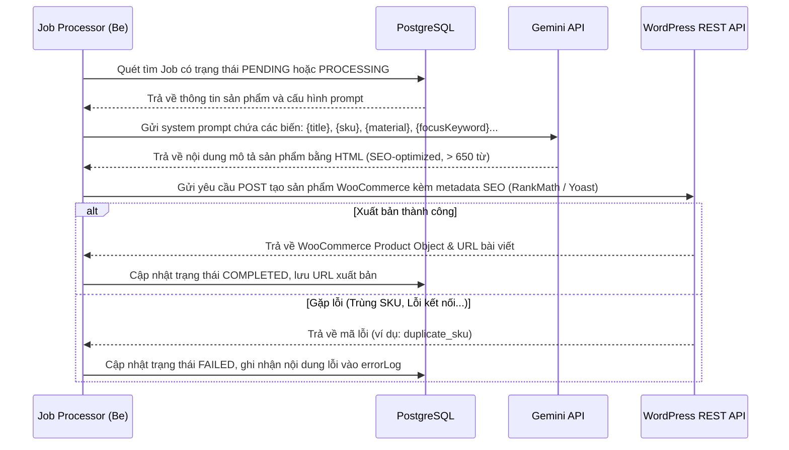

# Auto WP Publisher 🚗💨

**Hệ thống tự động hóa đăng bài sản phẩm lên WordPress từ file Excel & Tối ưu hóa SEO bằng AI - Thiết kế theo chuẩn Enterprise!**

---

## 🌟 Tổng quan dự án

`Auto WP Publisher` là một hệ thống cao cấp quản lý luồng dữ liệu (Data Pipeline) từ khâu nhập Excel thô, xử lý tối ưu hóa nội dung bằng trí tuệ nhân tạo (AI Gemini), tự động cấu hình siêu dữ liệu SEO (RankMath / Yoast SEO) và xuất bản tự động lên các website WordPress (WooCommerce) với quy mô hàng ngàn sản phẩm (Enterprise Scale).

Dự án được xây dựng dưới cấu trúc **Monorepo** hiện đại, áp dụng **Domain-Driven Design (DDD)** và kiến trúc Hexagonal (Ports & Adapters) ở phía Backend để đảm bảo hệ thống có khả năng mở rộng, bảo trì và chịu tải tốt.

---

## 📐 Kiến trúc hệ thống (Architecture)

Hệ thống được tổ chức dưới dạng **Monorepo** quản lý bởi **Turborepo** nhằm chia sẻ mã nguồn và tài nguyên giữa các thành phần một cách tối ưu nhất:

### 1. Phân rã dự án (Monorepo Workspace)
*   **`apps/web`**: Ứng dụng Single Page Application (SPA) viết bằng React, Vite, Ant Design (v5) và Tailwind CSS.
*   **`apps/server`**: Ứng dụng Backend viết bằng NestJS, sử dụng Prisma ORM kết nối cơ sở dữ liệu PostgreSQL.
*   **`packages/shared`**: Thư viện chứa các hàm tiện ích, DTOs và cấu hình dùng chung giữa Frontend và Backend.
*   **`packages/database`**: Chứa Prisma schema và các tệp khởi tạo database (migrations).

### 2. Backend DDD & Hexagonal Architecture (`apps/server/src`)
Mã nguồn Backend được chia theo các **Bounded Context** rõ ràng, cụ thể:
*   **`contexts/catalog`**: Quản lý nghiệp vụ chính liên quan đến sản phẩm, luồng Job và Logs API.
*   **`contexts/iam`**: Quản lý thông tin định danh và quyền truy cập (Identity & Access Management).
*   **`shared`**: Chứa hạ tầng dùng chung (Prisma Service, base domain classes).

Mỗi Bounded Context (như `contexts/catalog/products`) được tổ chức thành 3 lớp riêng biệt:
1.  **`domain`**:
    *   Chứa các thực thể chính (Entities), Value Objects, định nghĩa Aggregate Root.
    *   Khai báo Interfaces cho các Repository (Ports).
2.  **`application`**:
    *   Áp dụng mô hình **CQRS** (Command Query Responsibility Segregation) thông qua thư viện `@nestjs/cqrs`.
    *   Chia rõ ràng các hành động thay đổi trạng thái (Commands) và các hành động truy vấn dữ liệu (Queries) kèm Handlers tương ứng.
3.  **`infrastructure`**:
    *   Hiện thực hóa các Repository bằng Prisma Client kết nối PostgreSQL (Adapters).
    *   Bộ định tuyến HTTP REST (Controllers) tiếp nhận yêu cầu từ client.
    *   Tích hợp dịch vụ bên thứ ba (WooCommerce REST API, Gemini AI SDK).

---

## ⚙️ Công nghệ sử dụng (Technology Stack)

| Thành phần | Công nghệ chủ đạo | Vai trò / Chi tiết |
| :--- | :--- | :--- |
| **Monorepo** | Turborepo, pnpm | Quản lý đa gói (Multi-package) tốc độ cao và tối ưu hóa bộ nhớ đệm (Caching). |
| **Frontend** | React 18, Vite, TypeScript | Trình đóng gói SPA siêu tốc, tối ưu hóa kích thước bundle. |
| **Styling UI** | Ant Design v5, Tailwind CSS | Giao diện Premium đồng bộ, hỗ trợ dynamic light/dark theme phản hồi tức thì. |
| **State Management**| TanStack Query (React Query) | Quản lý cache API client-side, đồng bộ trạng thái server mượt mà. |
| **Backend Framework**| NestJS v10 | Hỗ trợ cấu trúc DI (Dependency Injection), CQRS Module mạnh mẽ. |
| **Database & ORM** | PostgreSQL, Prisma ORM | Cơ sở dữ liệu quan hệ mạnh mẽ, Prisma hỗ trợ tự động sinh migrations và gõ kiểu tĩnh (type-safe). |
| **AI Engine** | Google Gemini API | Sử dụng mô hình `gemini-2.5-flash` và `gemini-2.5-pro` để tự động hóa viết mô tả chuẩn SEO. |
| **Integration** | WordPress REST API, WooCommerce | Đăng tải và đồng bộ bài viết/sản phẩm và cấu trúc phân cấp danh mục. |

---

## 🔄 Luồng hoạt động chính (Workflows & Pipelines)

### 1. Luồng nhập liệu Job từ Excel (Excel Import & Mapping Pipeline)

### 2. Luồng tối ưu hóa AI & Đăng tải WordPress (Job Execution & SEO Publishing Pipeline)

---

## 🎨 Giao diện & Trải nghiệm người dùng (UX/UI Highlights)

*   **Đồng bộ giao diện Ant Design Dynamic Theme**: 
    *   Tự động phát hiện và chuyển đổi mượt mà giữa chế độ sáng (**Light Mode**) và tối (**Dark Mode**).
    *   Sidebar thay đổi màu nền thông minh (Trắng tinh khiết ở Light mode, viền xám nhạt `#ECECEC`; và Xám đậm `#1F1F1F`, viền `#303030` ở Dark mode).
*   **Bố cục Dashboard cân đối**:
    *   Bảng điều hành hiển thị 4 chỉ số cốt lõi: Tổng Job, Thành công, Đang xử lý, Thất bại.
    *   Biểu đồ hoạt động Recharts 7 ngày song song với thanh **Phân tích tỷ lệ lỗi** trực quan.
    *   Thanh **Thao tác nhanh (Quick Actions)** nằm dưới cùng gồm 4 nút tắt giúp quản trị viên truy cập nhanh tới các chức năng thiết yếu.
*   **Trình thiết kế Prompt tương tác thông minh**:
    *   Trang cấu hình Prompt cho phép người dùng click nhanh vào danh sách các Tag tương thích (`{title}`, `{sku}`, `{material}`, `{focusKeyword}`,...) để chèn trực tiếp vào vị trí con trỏ của ô soạn thảo một cách nhanh chóng và chính xác.

---

## 📝 Giấy phép
Dự án được phát triển và vận hành bởi **trhgatu**.
